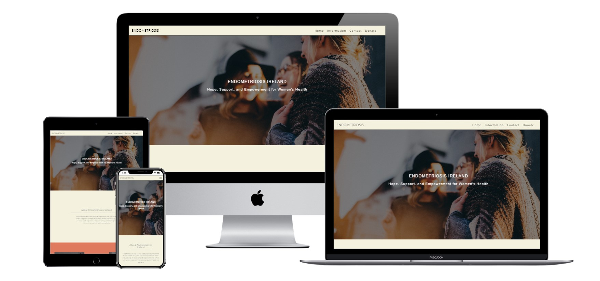

# Endometriosis Ireland

My website's main objective is to raise awareness about Endometriosis, a condition that affects approximately 6 million women. I provide basic information about the symptoms, diagnoses, and recent research on Endometriosis. Additionally, I aim to create a sense of community by sharing links to forums where people can share their experiences and support one another.

The site is live, the link is <a href="https://nathan-cool.github.io/Endometriosis_Ireland/" target="_blank">HERE</a>

## Conents
- [User Story](#user-story)
  - [Overview](#overview)
  - [User Stories](#user-stories)
  - [New User Stories](#new-user-stories)
  - [Existing User Stories](#existing-user-stories)
- [Design](#Design)
  - [Wireframes](#wireframes)
  - [Color Scheme](#color-scheme)
  - [Typography](#typography)
  - [Imagery](#imagery)
  - [Effects](#effects)
  - [Design Choices](#design-choices)
- [Features](#Features)
  - [Navigation Bar](#navigation-bar)
  - [Hero Image](#hero-image)
  - [About Section](#about-section)
  - [Images Section](#images-section)
  - [Information Section](#information-section)
  - [Donate Section](#donate-section)
  - [Contact Us Section](#contact-us-section)
  - [Footer](#footer)
  - [404 Page](#404-page)
  - [Future Features](#future-features)
- [Technologies Used](#Technologies-Used)
  - [Languages](#languages)
  - [Libraries and Programs](#libraries-and-programs)
- [Testing](#testing)
  - [Device Testing](#device-testing)
  - [HTML-W3C-Validator](#html-w3c-validator)
  - [CSS-Validator](#css-validator)
  - [Lighthouse Testing](#lighthouse-testing)
  - [Browser Testing](#browser-testing)
  - [Fixed Bugs](#fixed-bugs)
  - [Implementation](#implementation)
- [Deplyment](#Deployment)
  - [GitHub Pages](#github-pages)
  - [Credits](#credits)

## User Story

My website's primary objective is to raise awareness about Endometriosis by providing people with relevant information. The intended audience for the website is females aged between 14-55, as this group is usually the most affected by this condition.

The end-users visiting the website expect to gain knowledge about Endometriosis, find ways to get in touch with the charity and learn about the services and support offered by the organization.

Features to note are users can easily get in touch, donate, and join the community through links on the website. 

## New User Stories

As a first-time user of the website to be able to: 

- The website can be easily navigated.
- Find out what Endometriosis is
- Find out what some symptoms may be 
- How to get in touch with the charity 
- Easily locate social media links.
- Use the website on mobile devices easily

## Existing User Story 

An existing user of the website wants to be able to: 

- Contact the charity with any questions they may have
- View up-to-date social media links
- Quickly find and contact the charity for any inquiries or additional information.

# Design
## Wireframes
<table>
    <tr>
      <th>Device</th>
    </tr>
    <tr>
      <td>Mobile</td>
    </tr>
    <tr>
      <td>Tablet</td>
    </tr>
    <tr>
        <td>Desktop</td>
    </tr>
  </table>

## Colour Scheme
- The website's colour scheme is colourful yet minimlist.
- The colours of each section are in contrast to one another.

## Typography
- For this website, Open Sans Light was chosen for headings to complement the minimalist and elegant design.
- The regular font weight of Open Sans was chosen for everything else. 

## Imagery
- Imagery for this website was taken from various stock photos website which are referenced in the credits section.
- Images were selected to match the website's theme, with a transparent black overlay added to ensure the legibility of the text.
- The hero image was selected to provide a vibrant and colourful introduction to my website, while still maintaining the website's theme.

## Effects
 - When you hover over the links in the navigation bar, they appear in greyish to indicate that they are being highlighted.
 - A smooth scroll is activated upon clicking links, bringing you to the corresponding section of the website.
 - On mobile devices, there is a burger icon that, when clicked, reveals a navigation bar for selecting buttons.
 - When an image is hovered over, it will change size with a transition effect.
 - When you hover your cursor over buttons, they will have an effect where their colour changes.

## Design choices
- The website is consistent across all screen sizes as much as possible.
- I created clickable images that change their behaviour when hovered over.
- I redesigned the website as a single page with a navigation bar linking to each section
- The design has been kept as minimalistic as possible to ensure easy navigation. Any unnecessary clutter has been removed to make it easier for users to find their way around.

# Fetures
## Navigation Bar
  - The logo on the top right is easy to locate and will link back to the hero image.
  - Each section of the website will have a link on the navigation bar that leads directly to it.
  - On smaller screens, a 'Burger' toggle reveals a navigation menu.
  - When you hover over the navigation menu, the links will change colour to indicate which one you are about to select.
 
## Hero Image
- The hero image appears right below the navigation bar on the index.html page. It is a colourful image meant to give a warm welcome to the website.
- A black transparent overlay is used to enhance the contrast between the message displayed and the image itself.
- The 404 error page will not display the hero image.

## About Section
- This section provides a brief introduction to Endometriosis Ireland, explaining who they are and what they do.
- The text is responsive across all screen sizes.

## Images Section
- Three clickable images are displayed in this section, which takes the user to official Endometriosis Ireland pages.
- The images are responsive and expand into a row on bigger screens and a column on smaller screens.
- A black transparent overlay is used to ensure a contrast between the message displayed and the image itself.
- The images have a hover effect to indicate that they are clickable.

## Information Section
- This section comprises four subsections that provide basic information about Endometriosis.
- The background is grey with white text to ensure a clear contrast between the background and text.
- The section is responsive and dynamically adjusts to display all four boxes in a row.

## Donate Section
- This section prompts the user to donate to the Endometriosis Ireland page.
- The button is responsive and adapts to different screen sizes.
- The button links to the official Endometriosis Ireland donate page.
- The background and text colours are chosen to ensure clear contrast.
- The button inverts colours on hover to indicate that it is clickable.

## Contact Us Section
- This section provides a way for the user to contact Endometriosis Ireland for more information or to volunteer.
- Asterisks are used to mark the input fields that are required to be filled.
- The input fields adjust to available space on the device, growing on bigger devices and shrinking on smaller ones.
- Each input field has a title, which appears inside the box.
- The background colour is orange, and the text is black to ensure clear contrast.
- The button inverts colours on hover to indicate that it is clickable.

## Footer
- The footer has a minimal design and links to the social media accounts of Endometriosis Ireland.
- The social media links are black icons with a hover effect to indicate that they are clickable.
- The icons stack on smaller screens and grow into a row on bigger screens.

## 404 Page

  ## Future Features:
- A map to show the drop-in location of Endometriosis Ireland
- An integrated forum for users to join
- A page to give detailed answers to questions

# Technologies Used
## Languages
The following languages were used: HTML5 and CSS3.

## Libraries and Programs:
- Visual Studio Code was used as the code editor.
- GitHub desktop was used to view repository changes.
- GitHub was used to upload the repository.
- Google fonts were used for the fonts.
- Font awesome was used for the social media icons.

# Testing:
## Device Tesing
At the beginning of the project, a mobile-first design was implemented and adjustments were made to ensure it looked good on all screen sizes. The following devices were tested:
- iPhone SE
- iPhone X
- iPhone 14
- 24" computer screen (1920 by 1080)
- Laptop 13" (2560 by 1600)

## HTML-W3C-Validator 

## CSS-Validator  

## Lighthouse testing

## Browser Testing

## Fixed Bugs

## Implementation:
During development, the developer tools in Google Chrome were used primarily for testing devices. The selector tool was used to select certain elements on the page, and this was done on each device by selecting the said device on developer tools. Design changes were implemented from the developer tools to see what the design or design change would look like. This greatly helped in the speed the ideas could be implemented. The website was tested on each device by opening the index.html in the live server, a plugin on Visual Studio Code. From there, developer tools were opened, and elements were first checked to make sure they were working as expected. Then, the code on developer tools was checked if the element worked as expected. If the element worked as expected, the next element was tested. The dimensions: responsive were also used to check the responsiveness of the website.

 

# Deployment
To deploy this website, I utilized Visual Studio Code and Git. I deployed the website to GitHub and then hosted it on GitHub Pages. This allows for easy accessibility, as the website can be viewed without the need to fork the repository. A step-by-step can be found below on how to deploy to GitHub page

Step 1: Go to Repository Settings
In your GitHub repository, go to the "Settings" tab.

Step 2: Scroll Down to GitHub Pages Section
Scroll down to the "GitHub Pages" section in the settings.

Step 3: Choose Your Branch
Under the "Source" section, select the branch you want to use for GitHub Pages. Typically, you might use the main or master branch.

Step 4: Save
Click on the "Save" button. GitHub Pages will generate a URL for your site.

# Credits

# Contents
The content about Endometriosis and Endometriosis Ireland was sourced from Wikipedia and the website Endometriosis.ie of Endometriosis Ireland. I have provided the links below.

- <a href="(https://en.wikipedia.org/wiki/Endometriosis)" target="_blank">Wikipeida</a>
- <a href="(https://www.endometriosis.ie/)" target="_blank">Endometriosis Ireland</a>

Throughout the page, Fontawesome was utilized for the favicons.

https://fontawesome.com/

Readme template taken from

https://github.com/Code-Institute-Solutions/readme-template

Tutorial and documentation used:

https://www.w3schools.com/html/
https://developer.mozilla.org/en-US/docs/
https://css-tricks.com/

Inspiration for some features came from templates created by this user:

https://github.com/nemixu/Milestone1

## Media

I found photos used on this website by using different terms on Google Image search and changing usage rights to Creative Commons licenses

    
 
   
    
  
    
